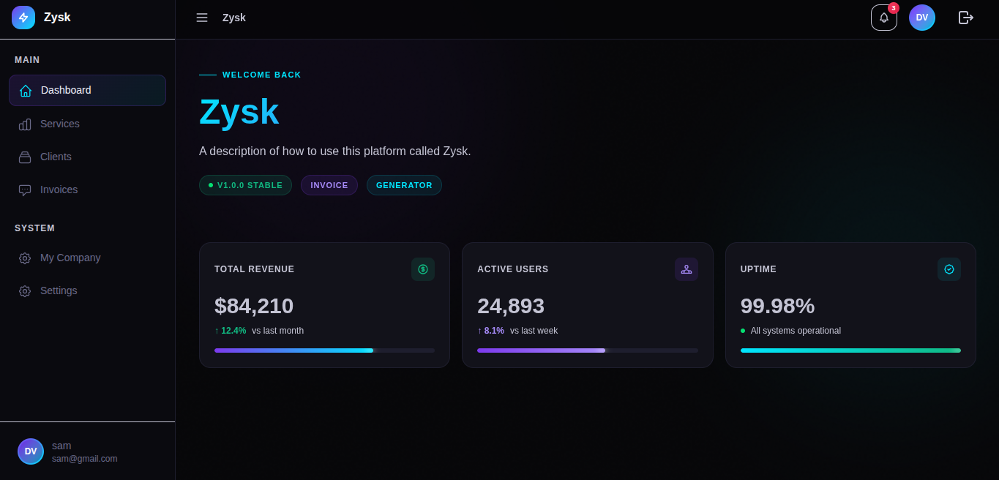
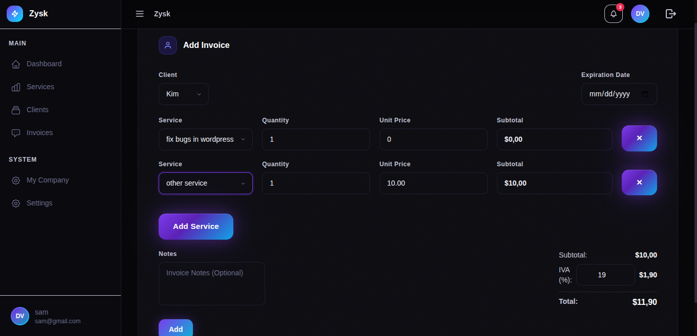
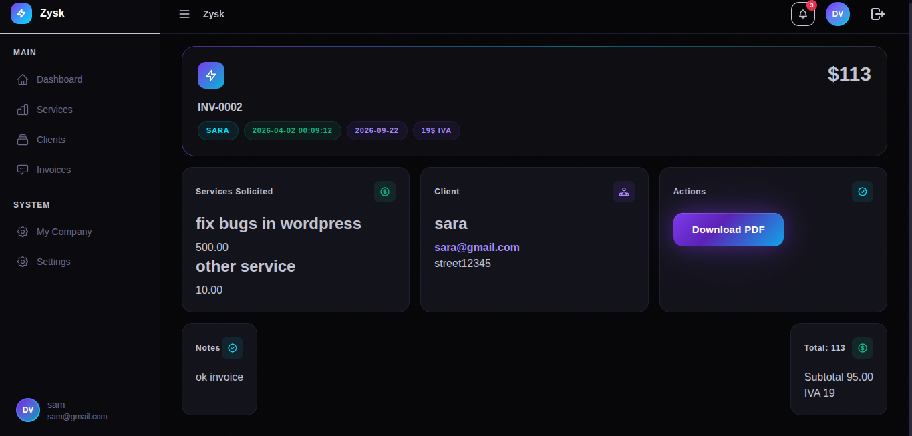
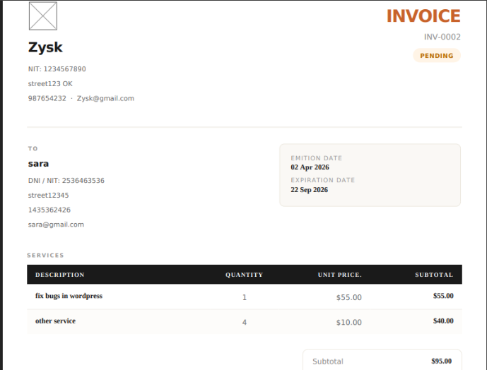

# Zysk — Invoice Generator

A web-based invoice management system built for small businesses. Create clients, manage services, generate invoices and download professional PDFs — all in one place.

**Live demo:** https://invoice-generator-production-2c41.up.railway.app



---

## Features

- **Client management** — Create and manage your client base with full contact details
- **Service catalog** — Define your services and pricing for quick invoice creation
- **Invoice generation** — Select a client, add services, and let the system calculate subtotals, tax and total automatically
- **PDF export** — Download a professional invoice PDF ready to send to your client
- **Company settings** — Configure your business info and branding for PDF generation

---

## Important notes:
- This is a demo, not a live service.
- It is not optimized for mobile, as that was not the goal of the project.

---

## Screenshots

| Dashboard | Create Invoice |
|-----------|---------------|
|  |  |

| Invoice Detail | PDF Export |
|----------------|------------|
|  |  |

---

## Tech Stack

- **Backend** — Laravel 11, PHP 8.2
- **Frontend** — Blade, Tailwind CSS
- **Database** — MariaDB
- **PDF** — DomPDF (barryvdh/laravel-dompdf)
- **DevOps** — Docker, Railway

---

## Local Setup

### Requirements

- PHP 8.2+
- Composer
- MySQL or Mariadb
- Docker (optional)

### Installation

```bash
# Clone the repository
git clone https://github.com/al3sxz/invoice-generator.git
cd invoice-generator

# Install dependencies
composer install

# Copy environment file
cp .env.example .env

# Generate application key
php artisan key:generate

# Configure your database in .env
DB_CONNECTION=mysql
DB_HOST=127.0.0.1
DB_PORT=3306
DB_DATABASE=invoice_generator
DB_USERNAME=root
DB_PASSWORD=

# Install node dependencies & frontend build
npm install
npm run build

# Run migrations and seeders
php artisan migrate --seed

# Start the server
php artisan serve
```

### With Docker

```bash
cp docker/local.env.example docker/local.env

docker compose up -d --build
docker compose exec app cp /app/.env.example /app/.env
docker compose exec app php artisan key:generate
docker compose exec app php artisan migrate --force
docker compose exec app php artisan storage:link
php artisan db:seed --class=CompanySeeder
```

---

## Database Structure

```
clients         — Client information
services        — Service catalog with pricing
invoices        — Invoice headers with totals and status
invoice_service — Pivot table with line items (quantity, unit price, subtotal)
companies       — Business configuration for PDF generation
```

---

## License

MIT